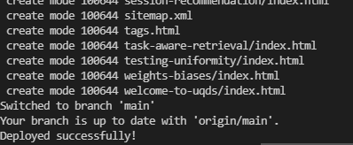

# UQ DS Seminar Website
### [Web Link](https://uq-ds-seminar.github.io/)

## Documentation

[How to install & use](https://bootstrapstarter.com/bootstrap-templates/mundana-theme-jekyll/)

### Contribute to Mundana repository

1. **Clone a copy of your fork on your local**

   `git clone https://github.com/Luoyadan/UQDS-Seminar.git`

2. **Set up Jekyll**: 

   Assuming you have [Ruby](https://www.ruby-lang.org/en/downloads/) and [Bundler](https://bundler.io/) installed on your system (*hint: for ease of managing ruby gems, consider using [rbenv](https://github.com/rbenv/rbenv)*)

   ```bash
   $ bundle install
   # assuming pip is your Python package manager
   $ pip install jupyter
   $ bundle exec jekyll serve --lsi
   ```

3. **Make necessary changes and commit those changes**:
   To advertise new talks, please go to `_posts` folder and create a new markdown file

   - For speaker profile: please upload to `assets/images/speakers/`
   - `date` is just for ordering old/new talks; `display_date` will be appeared on web
   - For upcoming seminar, simply mark them `featured` in the `tags` attribute

   Once you finished your edits, add and commit those changes by:

   `git add .`

   `git commit -m "updates"`

   

2. **Push changes and deployment**

   `git push`

   Then, to allow those changes to be activated, use the helper function:

   `bin/deploy --user`

   Then you will see the following message for successful deployment:

   


That's it! Soon I'll be merging your changes into the master branch of this project. 


